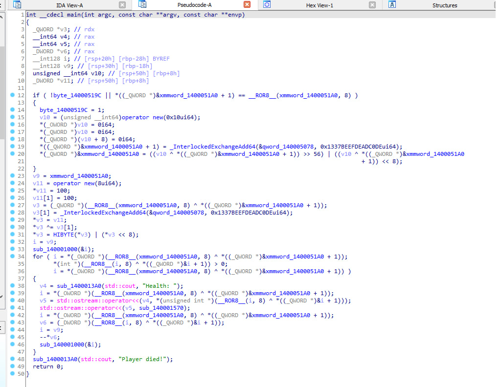

# obfuscated-pointer
A realization of obfuscated pointers in C++

- Pointer is encrypted in memory.
- Pointer requires decryption during access.
- It gives an extra hurdle to attackers since the generated code makes common disassemblers and attackers busy.

## Usage
```C++
class Player {
public:
	int health;
	int armor;
public:
	Player(int health, int armor) : health(health), armor(armor) {};
	void hurt() {
		health--;
	};
	void heal() {
		health++;
	};
};

eq3::encrypted_pointer<Player> local_player = new Player(100, 0); // The new instance will be immediately encrypted and all its calls will be obfuscated
```
Calling methods and getting values ​​is the same as with regular pointers:
```C++
if (local_player->health < 10)
    local_player->heal(); // never die lol
```
You can dynamically set other pointer and use it:
```C++
local_player = new Player(100, 0);
/* or */
local_player.set(new Player(100, 0));
/* or if you have an existing pointer */
local_player = *(Player**)((uintptr_t)client_instance + 1337);
```
Decompilation example:


## Known issues
- A smart pointers has not been added, which is why it is better to use only static and important pointers that will live for a long time
- Almost the same pattern on each pointer
- Static addresses remain, which can be dangerous
- Small bunch of operators implemented

## Credits
- https://antispy.xyz/docs/encrypted-pointer - for showing how this crap should look in code
- https://chatgpt.com - for consultation
